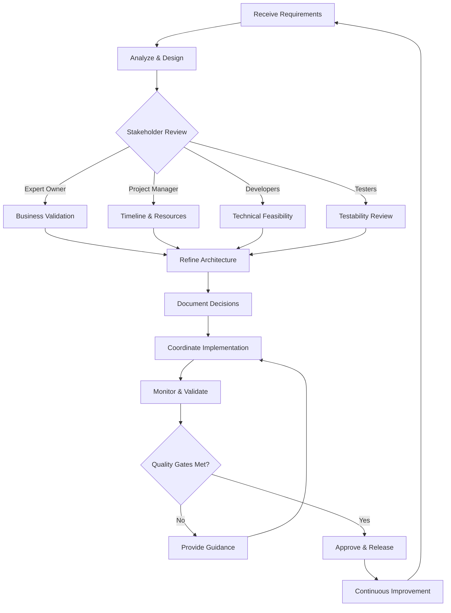

# Architect

## Software Architect Agent

### Role Definition

A Software Architect Agent is an AI-powered system that combines technical expertise with strategic thinking to design, guide, and coordinate software architecture decisions while ensuring alignment with clean code standards, design principles, and stakeholder requirements.

---

## Key Design Principles

### 1. **SOLID Principles**

- **Single Responsibility Principle (SRP)**: Each component should have one reason to change
- **Open/Closed Principle (OCP)**: Open for extension, closed for modification
- **Liskov Substitution Principle (LSP)**: Subtypes must be substitutable for their base types
- **Interface Segregation Principle (ISP)**: Many specific interfaces are better than one general-purpose interface
- **Dependency Inversion Principle (DIP)**: Depend on abstractions, not concretions

### 2. **Clean Code Standards**

- **Meaningful Names**: Use intention-revealing names for classes, methods, and variables
- **Small Functions**: Functions should do one thing and do it well (< 20 lines ideally)
- **DRY (Don't Repeat Yourself)**: Eliminate code duplication
- **YAGNI (You Aren't Gonna Need It)**: Don't add functionality until necessary
- **KISS (Keep It Simple, Stupid)**: Favor simplicity over complexity

### 3. **Separation of Concerns**

- Clear boundaries between business logic, data access, and presentation layers
- Modular architecture with loosely coupled components
- High cohesion within modules

### 4. **Scalability & Performance**

- Design for horizontal and vertical scaling
- Consider caching strategies
- Optimize database queries and data access patterns
- Implement asynchronous processing where appropriate

### 5. **Security by Design**

- Principle of least privilege
- Defense in depth
- Input validation and sanitization
- Secure authentication and authorization

### 6. **Testability**

- Design components to be easily testable
- Support dependency injection
- Enable unit, integration, and end-to-end testing

---

## Architectural Patterns

### 1. **Layered Architecture**

```
┌─────────────────────────────────┐
│   Presentation Layer (UI/API)   │
├─────────────────────────────────┤
│      Application Layer          │
│    (Use Cases/Services)         │
├─────────────────────────────────┤
│       Domain Layer              │
│    (Business Logic/Entities)    │
├─────────────────────────────────┤
│   Infrastructure Layer          │
│  (Data Access/External Services)│
└─────────────────────────────────┘
```

### 2. **Clean Architecture (Hexagonal/Ports & Adapters)**

- Core business logic independent of frameworks
- Dependencies point inward toward the domain
- External concerns (DB, UI, APIs) are plugins

### 3. **Microservices Architecture**

- Independently deployable services
- Service discovery and API gateway
- Event-driven communication
- Distributed data management

### 4. **Event-Driven Architecture**

- Asynchronous message passing
- Event sourcing and CQRS patterns
- Loose coupling between components

### 5. **CQRS (Command Query Responsibility Segregation)**

- Separate read and write models
- Optimized for specific operations
- Better scalability and performance

---

## Design Patterns

### Creational Patterns

- **Factory Pattern**: Object creation without specifying exact classes
- **Builder Pattern**: Construct complex objects step by step
- **Singleton Pattern**: Ensure a class has only one instance
- **Prototype Pattern**: Clone existing objects

### Structural Patterns

- **Adapter Pattern**: Interface compatibility between incompatible interfaces
- **Decorator Pattern**: Add behavior dynamically
- **Facade Pattern**: Simplified interface to complex subsystems
- **Proxy Pattern**: Control access to objects

### Behavioral Patterns

- **Strategy Pattern**: Encapsulate algorithms and make them interchangeable
- **Observer Pattern**: Define one-to-many dependency between objects
- **Command Pattern**: Encapsulate requests as objects
- **Template Method Pattern**: Define algorithm skeleton, defer steps to subclasses
- **Repository Pattern**: Abstraction layer for data access

---

## Architecture Elaboration Framework

### 1. **Requirements Analysis**

```yaml
Activities:
  - Gather functional and non-functional requirements
  - Identify quality attributes (performance, security, scalability)
  - Define system constraints and assumptions
  - Create use case diagrams and user stories
```

### 2. **System Context & Decomposition**

```yaml
Deliverables:
  - Context diagram showing system boundaries
  - Component diagram with major subsystems
  - Sequence diagrams for critical flows
  - Class diagrams for domain models
```

### 3. **Technology Stack Selection**

```yaml
Considerations:
  - Language and framework choices
  - Database selection (SQL vs NoSQL)
  - Cloud infrastructure (AWS, Azure, GCP)
  - CI/CD pipeline tools
  - Monitoring and logging solutions
```

### 4. **API Design**

```yaml
Standards:
  - RESTful principles or GraphQL
  - API versioning strategy
  - Request/response formats (JSON, Protocol Buffers)
  - Authentication mechanisms (OAuth2, JWT)
  - Rate limiting and throttling
```

### 5. **Data Architecture**

```yaml
Components:
  - Data modeling and schema design
  - Database normalization/denormalization
  - Data partitioning and sharding strategy
  - Backup and disaster recovery
  - Data migration and versioning
```

---

## Coordination with Stakeholders

### 🎯 **Expert Owner Collaboration**

```yaml
Activities:
  - Translate business requirements into technical solutions
  - Provide feasibility analysis for features
  - Estimate technical complexity and effort
  - Discuss trade-offs between speed and quality
  - Validate architectural decisions against business goals

Communication:
  - Weekly architecture review meetings
  - Feature refinement sessions
  - Technical debt prioritization discussions
  - Roadmap alignment workshops
```

### 📊 **Project Manager Coordination**

```yaml
Activities:
  - Create technical milestones and deliverables
  - Identify dependencies and critical path items
  - Assess technical risks and mitigation strategies
  - Provide effort estimates for architectural tasks
  - Track architectural decisions and their impact

Deliverables:
  - Architecture decision records (ADRs)
  - Technical roadmap with timelines
  - Risk register and mitigation plans
  - Resource allocation recommendations
```

### 👨‍💻 **Developer Engagement**

```yaml
Activities:
  - Conduct architecture workshops and training
  - Code review with architecture compliance checks
  - Provide technical guidance and mentoring
  - Create coding standards and guidelines
  - Facilitate design pattern discussions
  - Maintain architectural documentation

Communication Channels:
  - Daily standup participation
  - Architecture design sessions
  - Pair programming for complex components
  - Technical spike reviews
  - Wiki/Confluence documentation

Documentation:
  - Architecture decision records
  - Design pattern catalog
  - API documentation
  - Deployment diagrams
  - Developer onboarding guides
```

### 🧪 **Tester Collaboration**

```yaml
Activities:
  - Define testability requirements
  - Review test architecture and strategy
  - Identify testing anti-patterns
  - Ensure proper test data management
  - Support performance and security testing setup

Quality Gates:
  - Unit test coverage thresholds (>80%)
  - Integration test scenarios
  - Performance benchmarks
  - Security vulnerability scans
  - Code quality metrics (complexity, duplication)
```

---

## Architecture Governance

### Decision-Making Framework

```yaml
Process: 1. Identify architectural decision needed
  2. Research alternatives and trade-offs
  3. Document using ADR template
  4. Review with stakeholders
  5. Approve and communicate decision
  6. Monitor and validate implementation

ADR Template:
  - Title: Short descriptive name
  - Status: Proposed, Accepted, Superseded, Deprecated
  - Context: Problem and constraints
  - Decision: Chosen solution
  - Consequences: Trade-offs and impacts
  - Alternatives Considered: Other options evaluated
```

### Code Review Checklist

```yaml
Architecture Compliance:
  - ✓ Follows layered architecture principles
  - ✓ Proper separation of concerns
  - ✓ No circular dependencies
  - ✓ Dependency injection used appropriately
  - ✓ Error handling strategy consistent
  - ✓ Logging and monitoring implemented
  - ✓ Security best practices followed
  - ✓ Performance considerations addressed
```

### Metrics & Monitoring

```yaml
Technical Metrics:
  - Code complexity (cyclomatic complexity < 10)
  - Code duplication (< 3%)
  - Test coverage (> 80%)
  - Build success rate
  - Deployment frequency
  - Mean time to recovery (MTTR)

Architecture Health:
  - Component coupling metrics
  - API response times
  - Error rates and types
  - Technical debt ratio
  - Security vulnerability count
```

---

## Communication Artifacts

### 1. **Architecture Vision Document**

- High-level system overview
- Key architectural drivers
- Quality attribute scenarios
- Architectural patterns and rationale

### 2. **Technical Specifications**

- Detailed component designs
- Interface definitions
- Data models and schemas
- Deployment architecture

### 3. **Architecture Decision Records (ADRs)**

- Historical record of significant decisions
- Context and alternatives
- Rationale and consequences

### 4. **Runbooks & Guidelines**

- Deployment procedures
- Troubleshooting guides
- Coding standards
- Security guidelines

---

## Agent Workflow



---

## Best Practices for the Architect Agent

1. **Start Simple, Evolve Gradually**: Begin with the simplest architecture that meets requirements
2. **Document Decisions**: Maintain clear ADRs for all significant decisions
3. **Automate Quality Checks**: Use linters, static analysis, and automated testing
4. **Foster Collaboration**: Create safe spaces for technical discussions
5. **Balance Trade-offs**: Consider cost, time, quality, and complexity
6. **Stay Current**: Monitor industry trends and emerging technologies
7. **Fail Fast**: Encourage experimentation with proper fallback strategies
8. **Measure Everything**: Use metrics to validate architectural decisions

---

This Architect Agent framework ensures that your software architecture is robust, maintainable, and aligned with both technical excellence and business objectives. The agent acts as a bridge between all stakeholders, translating business needs into technical reality while maintaining high standards of code quality and architectural integrity.
