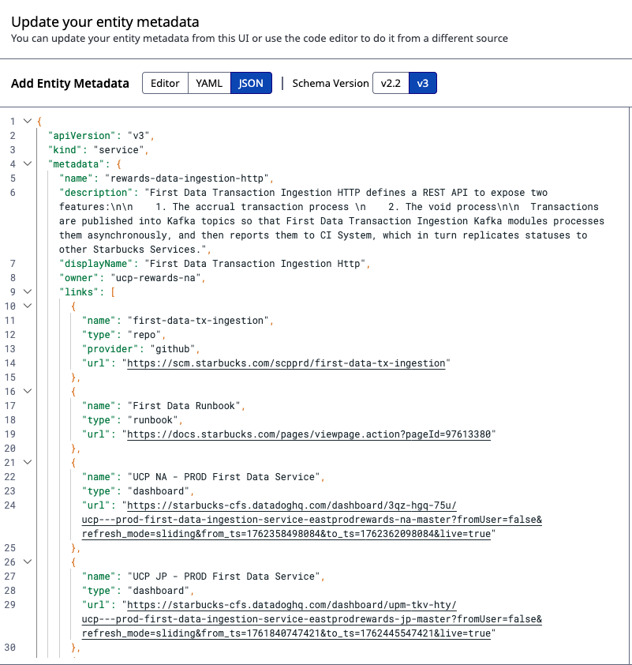
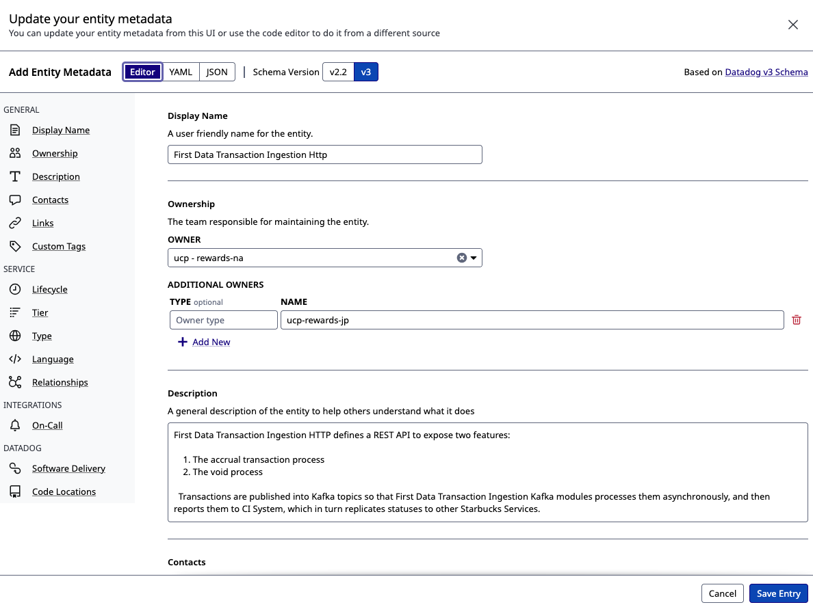

# JsonVersionManager - UI Guide

## Overview

The JsonVersionManager user interface provides business users with an intuitive way to manage metadata documents without requiring technical expertise. The UI bridges the gap between structured schemas and flexible custom properties, offering both guided form controls and raw JSON editing for power users.

## UI Architecture

### Design Goals
- **Accessibility first**: WCAG 2.1 AA compliant
- **Progressive disclosure**: Show complexity only when needed
- **Immediate feedback**: Inline validation and real-time updates
- **Dual-mode editing**: Forms for business users, JSON for power users
- **Mobile-aware**: Responsive design with desktop as primary target

### Visual Design References

The following mockups illustrate key UI components:

#### JSON Editor Interface


#### UI Editor Mode


_Note: These are conceptual mockups and will evolve during implementation._

---

## Core UI Components

### 1. Document Editor

The heart of the application where users create and modify metadata documents.

#### Schema-Driven Form Renderer

**Purpose**: Convert JSON Schema into business-friendly UI controls

**Field Types & Controls**:

| Schema Type | UI Control | Example |
|------------|------------|---------|
| `string` | Text input | Campaign name, description |
| `string` (enum) | Dropdown select | Status: Active/Inactive/Expired |
| `string` (format: email) | Email input with validation | contact@example.com |
| `string` (format: uri) | URL input with validation | https://example.com |
| `string` (format: date) | Date picker | 2025-12-31 |
| `string` (format: date-time) | Date-time picker | 2025-12-31T23:59:59Z |
| `number` / `integer` | Number spinner | Discount percentage: 0-100 |
| `boolean` | Checkbox or toggle | Active: ☑ / ☐ |
| `object` | Nested fieldset with expand/collapse | Address: {street, city, zip} |
| `array` | List editor with add/remove | Tags: [loyalty, premium, seasonal] |

**Layout**:
```
┌─────────────────────────────────────┐
│ Document Editor - Loyalty Offer     │
├─────────────────────────────────────┤
│                                     │
│ Offer Name *            [_______]   │
│ Description             [_______]   │
│                         [_______]   │
│ Discount Type           [Dropdown]  │
│   ○ Percentage  ● Fixed Amount      │
│ Discount Value *        [  25  ↕]   │
│ Valid From              [📅 Picker]  │
│ Valid To                [📅 Picker]  │
│ Active                  [☑ Toggle]   │
│                                     │
│ ▼ Custom Properties                 │
│   internalCode         [_______]    │
│   campaignId           [_______]    │
│   + Add Custom Property             │
│                                     │
│ [Cancel] [Save Draft] [Submit] >   │
└─────────────────────────────────────┘
```

**Features**:
- **Required field indicators**: Asterisk (*) next to label
- **Field hints**: Tooltip icons with contextual help
- **Inline validation**: Real-time error messages below field
- **Conditional fields**: Show/hide based on other field values
- **Default values**: Pre-populated from schema or template

#### Custom Properties Panel

**Purpose**: Allow users to add extension fields not in base schema

**Interface**:
```
┌─────────────────────────────────────┐
│ ▼ Custom Properties                 │
├─────────────────────────────────────┤
│ Property Name        Type   Value   │
│ [internalCode     ] [Text] [XYZ123] │
│ [campaignId       ] [Num ] [45678 ] │
│ [metadata         ] [Obj ] [Edit...] │
│                                     │
│ + Add Custom Property               │
│                                     │
│ Rules:                              │
│ • Max depth: 5 levels              │
│ • Use camelCase naming             │
│ • No reserved keywords             │
└─────────────────────────────────────┘
```

**Type Options**:
- Text (string)
- Number (integer/float)
- Boolean (true/false)
- Object (nested properties)
- Array (list of values)

**Validation**:
- Name must be unique within document
- Name must match pattern: `^[a-z][a-zA-Z0-9]*$` (camelCase)
- Depth limit enforced (max 5 levels of nesting)
- Reserved keywords prevented (e.g., `__proto__`, `constructor`)

#### Dual-Mode Toggle

**Purpose**: Switch between guided form and raw JSON editor

**Modes**:

**Form Mode** (Default for business users)
- Schema-driven controls
- Inline validation
- Field-level help text
- No JSON syntax knowledge required

**JSON Mode** (For power users)
- Monaco Editor with syntax highlighting
- Auto-completion based on schema
- Real-time validation
- Format/beautify button
- Line numbers and search

**Toggle Button**:
```
[📝 Form View | { } JSON View]
```

**Behavior**:
- Changes sync bidirectionally
- Switching triggers validation
- Invalid JSON prevents mode switch with error message
- JSON mode shows full document including metadata

---

### 2. Version Browser

**Purpose**: Navigate document history and understand evolution over time

#### Timeline View

```
┌─────────────────────────────────────────────────────┐
│ Version History - Loyalty Offer #12345              │
├─────────────────────────────────────────────────────┤
│ Search: [_________________] 🔍                      │
│ Filter: [All States ▼] [All Authors ▼] [Date ▼]   │
├─────────────────────────────────────────────────────┤
│                                                     │
│ ● v12 - PUBLISHED      Nov 10, 2025 14:32         │
│   by Maria Santos                                   │
│   Updated discount from 20% to 25%                 │
│   📊 2 modified                                     │
│   [View] [Compare] [Rollback]                      │
│                                                     │
│ ○ v11 - APPROVED       Nov 9, 2025 09:15          │
│   by Alex Johnson                                   │
│   Added new campaign tracking code                 │
│   📊 3 added, 1 modified                           │
│   [View] [Compare]                                 │
│                                                     │
│ ○ v10 - DRAFT          Nov 8, 2025 16:45          │
│   by Maria Santos                                   │
│   Extended validity period to end of year         │
│   📊 2 modified                                     │
│   [View] [Compare] [Delete]                        │
│                                                     │
│ ○ v9 - PUBLISHED       Nov 1, 2025 10:00          │
│   by Jordan Lee                                     │
│   Initial launch version                           │
│   📊 5 added, 8 modified                           │
│   [View] [Compare]                                 │
│                                                     │
│ [Load More Versions...]                            │
└─────────────────────────────────────────────────────┘
```

**Visual Indicators**:
- **State badges**: Color-coded (Draft: gray, Approved: blue, Published: green, Archived: red)
- **Author avatars**: User profile pictures or initials
- **Change statistics**: Icon + count (added, modified, removed)
- **Timestamps**: Relative (2 hours ago) and absolute (Nov 10, 2025 14:32)

**Actions**:
- **View**: Open version in read-only mode
- **Compare**: Diff against another version (select second version)
- **Rollback**: Create new version with content from this version
- **Delete**: Soft delete draft versions (requires permission)

#### Version Details Panel

**Expanded View** (Click version to expand):
```
┌─────────────────────────────────────────────────────┐
│ ▼ v12 - PUBLISHED      Nov 10, 2025 14:32         │
│   by Maria Santos                                   │
├─────────────────────────────────────────────────────┤
│ Change Summary:                                     │
│   Updated discount percentage from 20% to 25%      │
│                                                     │
│ Changes:                                            │
│   Modified: discount.value (20 → 25)               │
│   Modified: discount.lastUpdated (timestamp)       │
│                                                     │
│ Approval Details:                                   │
│   Approved by: Jordan Lee                          │
│   Approved at: Nov 10, 2025 14:30                  │
│   Published by: Maria Santos                        │
│   Published at: Nov 10, 2025 14:32                 │
│                                                     │
│ Comment:                                            │
│   "Increasing discount for Black Friday promo"     │
│                                                     │
│ [View Full Content] [Compare with v11]             │
└─────────────────────────────────────────────────────┘
```

---

### 3. Version Comparison (Diff Viewer)

**Purpose**: Visually compare two versions to understand changes

#### Side-by-Side View

```
┌───────────────────────────────────────────────────────────────┐
│ Compare Versions: v10 ↔ v12                                  │
│ [Export as PDF] [Export as JSON]                             │
├─────────────────────────────┬─────────────────────────────────┤
│ v10 (Nov 8, 2025)          │ v12 (Nov 10, 2025)             │
│ by Maria Santos             │ by Maria Santos                 │
├─────────────────────────────┼─────────────────────────────────┤
│ {                           │ {                               │
│   "offerName": "Holiday",   │   "offerName": "Holiday",       │
│   "discount": {             │   "discount": {                 │
│     "type": "percentage",   │     "type": "percentage",       │
│     "value": 20          ◄──┼──►  "value": 25              │ ← Modified
│   },                        │   },                            │
│   "validFrom": "2025-11-01",│   "validFrom": "2025-11-01",    │
│   "validTo": "2025-12-15"◄──┼──►  "validTo": "2025-12-31" │ ← Modified
│                             │   "campaignId": "BF2025"     │ ← Added
│ }                           │ }                               │
└─────────────────────────────┴─────────────────────────────────┘

Change Summary:
  2 modified    discount.value, validTo
  1 added       campaignId
  0 removed
  ⚠ 0 breaking changes
```

**Color Coding**:
- 🟢 **Green**: Added fields or lines
- 🔴 **Red**: Removed fields or lines
- 🟡 **Yellow**: Modified values
- ⚪ **White/Gray**: Unchanged content

**Features**:
- **Synchronized scrolling**: Both sides scroll together
- **Inline highlighting**: Changed portions within lines highlighted
- **Expand/collapse**: Focus on changed sections, hide unchanged
- **Change navigation**: Next/Previous buttons to jump between changes
- **Breaking change warnings**: Icon alerts for removed required fields or type changes
- **Export options**: PDF report or JSON patch format

#### Unified Diff View

Alternative view for users preferring patch-style diffs:

```
┌─────────────────────────────────────────────────────┐
│ Compare Versions: v10 → v12 (Unified Diff)         │
├─────────────────────────────────────────────────────┤
│ {                                                   │
│   "offerName": "Holiday Sale",                     │
│   "discount": {                                     │
│     "type": "percentage",                          │
│ -    "value": 20                                   │ ← Removed
│ +    "value": 25                                   │ ← Added
│   },                                                │
│   "validFrom": "2025-11-01",                       │
│ -  "validTo": "2025-12-15"                         │
│ +  "validTo": "2025-12-31"                         │
│ +  "campaignId": "BF2025"                          │
│ }                                                   │
└─────────────────────────────────────────────────────┘
```

---

### 4. Template Gallery

**Purpose**: Provide pre-configured starting points for common use cases

#### Gallery Interface

```
┌─────────────────────────────────────────────────────┐
│ Create New Document                                 │
│ Choose a template to get started:                   │
├─────────────────────────────────────────────────────┤
│                                                     │
│ ┌──────────────┐ ┌──────────────┐ ┌──────────────┐ │
│ │  🎁 Loyalty   │ │  🛍️ Retail    │ │  🎟️ Coupon    │ │
│ │    Offer      │ │   Campaign    │ │              │ │
│ │              │ │              │ │              │ │
│ │ Pre-filled   │ │ Marketing    │ │ Discount     │ │
│ │ loyalty      │ │ campaign     │ │ coupon with  │ │
│ │ program      │ │ structure    │ │ codes        │ │
│ │ structure    │ │ with         │ │              │ │
│ │              │ │ targeting    │ │              │ │
│ │ [Use]        │ │ [Use]        │ │ [Use]        │ │
│ └──────────────┘ └──────────────┘ └──────────────┘ │
│                                                     │
│ ┌──────────────┐ ┌──────────────┐                  │
│ │  📝 Custom    │ │  📋 Import   │                  │
│ │    Topic      │ │    JSON      │                  │
│ │              │ │              │                  │
│ │ Start from   │ │ Upload       │                  │
│ │ empty        │ │ existing     │                  │
│ │ schema       │ │ JSON file    │                  │
│ │              │ │              │                  │
│ │ [Use]        │ │ [Upload]     │                  │
│ └──────────────┘ └──────────────┘                  │
│                                                     │
└─────────────────────────────────────────────────────┘
```

#### Template Details

**Loyalty Offer Template**:
```json
{
  "offerName": "Sample Loyalty Offer",
  "description": "Describe your loyalty offer here",
  "tier": "gold",
  "discount": {
    "type": "percentage",
    "value": 10
  },
  "validFrom": "2025-01-01",
  "validTo": "2025-12-31",
  "active": true,
  "terms": "Standard terms and conditions apply"
}
```

**Retail Campaign Template**:
```json
{
  "campaignName": "Sample Campaign",
  "type": "seasonal",
  "channels": ["email", "sms", "app"],
  "targetAudience": {
    "segment": "all-customers",
    "minPurchaseHistory": 0
  },
  "schedule": {
    "startDate": "2025-01-01",
    "endDate": "2025-01-31"
  },
  "budget": {
    "amount": 10000,
    "currency": "USD"
  }
}
```

**Features**:
- **Preview**: Hover to see template structure
- **Customization**: Edit immediately after selection
- **Save as new template**: Power users can save custom templates

---

### 5. Workflow & State Management

**Purpose**: Guide users through document lifecycle with clear actions

#### State Diagram

```
     ┌─────┐
     │DRAFT│
     └──┬──┘
        │ Submit
        ▼
    ┌────────┐
    │APPROVED│
    └───┬────┘
        │ Publish
        ▼
   ┌─────────┐
   │PUBLISHED│
   └────┬────┘
        │ Archive
        ▼
   ┌─────────┐
   │ARCHIVED │
   └─────────┘
```

#### Action Buttons (Contextual)

**Draft State**:
```
[💾 Save Draft] [✓ Submit for Approval] [🗑️ Delete]
```

**Approved State**:
```
[📝 Edit] [🚀 Publish] [↩️ Reject]
```

**Published State**:
```
[📋 View] [↩️ Rollback] [📦 Archive]
```

**Permissions**:
- **Viewer**: Read-only access
- **Editor**: Create drafts, submit for approval
- **Approver**: Approve and publish versions
- **Admin**: All actions including schema management

---

### 6. Search & Filtering

**Purpose**: Quickly find documents and versions

#### Search Interface

```
┌─────────────────────────────────────────────────────┐
│ 🔍 Search Documents                                 │
│ [Search by name, content, or ID...        ] [Go]   │
├─────────────────────────────────────────────────────┤
│ Filters:                                            │
│ Topic:     [All Topics ▼]                          │
│ Author:    [All Authors ▼]                         │
│ State:     ☐ Draft  ☐ Approved  ☑ Published       │
│ Date:      [From: ____] [To: ____]                 │
│                                                     │
│ Sort by:   [Most Recent ▼]                         │
│                                                     │
│ [Clear Filters] [Save Search]                      │
└─────────────────────────────────────────────────────┘
```

#### Search Results

```
┌─────────────────────────────────────────────────────┐
│ Found 23 documents matching "holiday"               │
├─────────────────────────────────────────────────────┤
│ 🎁 Holiday Loyalty Offer                           │
│    Topic: Loyalty | State: Published | v12         │
│    Last updated Nov 10, 2025 by Maria Santos       │
│    "...25% discount for holiday season..."         │
│    [Open] [Compare]                                │
├─────────────────────────────────────────────────────┤
│ 🛍️ Holiday Campaign 2025                           │
│    Topic: Retail | State: Draft | v3              │
│    Last updated Nov 8, 2025 by Alex Johnson        │
│    "...email campaign for holiday shoppers..."     │
│    [Open] [Compare]                                │
├─────────────────────────────────────────────────────┤
│ ...more results...                                  │
│                                                     │
│ [1] [2] [3] ... [Next]                             │
└─────────────────────────────────────────────────────┘
```

---

## Responsive Design

### Desktop (Primary)
- Resolution: 1920x1080 and above
- Layout: Full sidebar navigation + main content area
- Editor: Side-by-side panels for form and preview

### Tablet (Secondary)
- Resolution: 768x1024
- Layout: Collapsible sidebar, single column content
- Editor: Stacked panels with tab switching

### Mobile (Tertiary - Read-Only)
- Resolution: 375x667 and above
- Layout: Hamburger menu, minimal chrome
- Functionality: View documents and history, no editing

---

## Accessibility Features

### Keyboard Navigation
- **Tab order**: Logical flow through form fields
- **Shortcuts**: 
  - `Ctrl/Cmd + S`: Save draft
  - `Ctrl/Cmd + Enter`: Submit
  - `Ctrl/Cmd + Z`: Undo
  - `Esc`: Cancel/close modal
- **Focus indicators**: Clear visual outline on focused elements

### Screen Reader Support
- **ARIA labels**: All interactive elements labeled
- **Live regions**: Announce validation errors and status updates
- **Semantic HTML**: Proper heading hierarchy, landmarks

### Visual Accessibility
- **Color contrast**: WCAG AA compliant (4.5:1 for text)
- **Focus indicators**: 3px outline with sufficient contrast
- **No color-only indicators**: Icons and text supplement color
- **Resizable text**: Layout supports up to 200% zoom

---

## Performance Targets

### Load Time
- Initial page load: <3 seconds
- Time to interactive: <5 seconds
- Large document (1MB JSON): <2 seconds to render

### Interactions
- Form field updates: <100ms response
- Version list pagination: <500ms per page
- Diff computation display: <2 seconds for 1MB documents
- Search results: <1 second

### Optimizations
- Code splitting by route
- Lazy load Monaco Editor (JSON mode)
- Virtual scrolling for large version lists
- Debounced search and validation
- Optimistic UI updates with rollback on error

---

_For API integration details, see [API_REFERENCE.md](./API_REFERENCE.md). For product roadmap, see [PRODUCT_ROADMAP.md](./PRODUCT_ROADMAP.md)._
